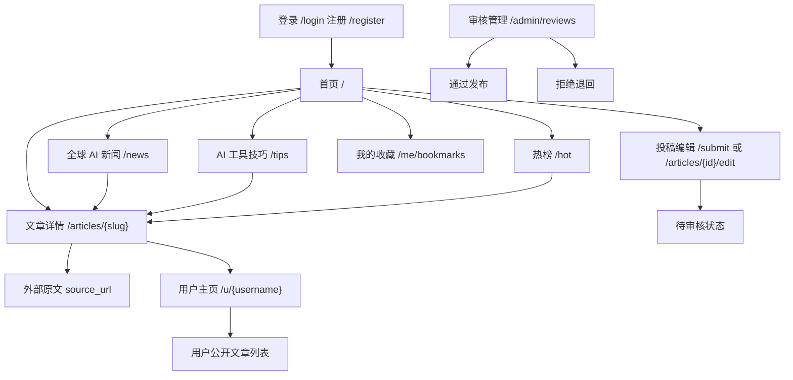
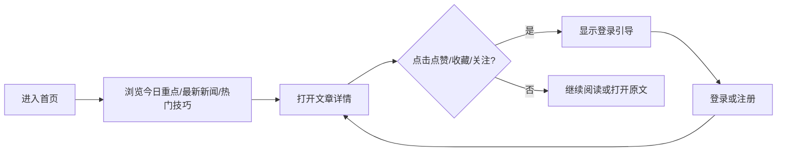
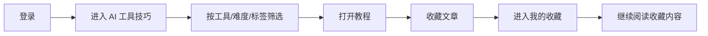
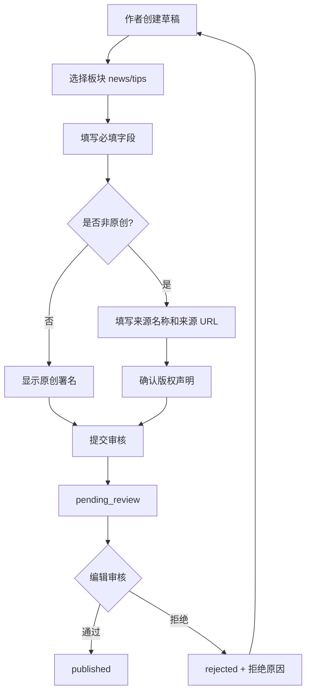
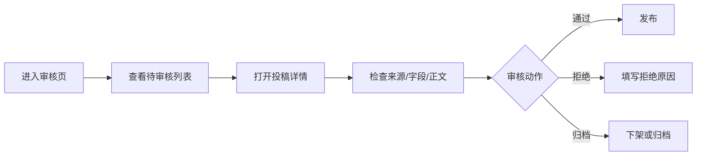

# AI 资讯站 Design

版本：v0.1  
日期：2026-07-06  
阶段：Design  
状态：已定稿，可进入 Implementation 准备阶段

## 1. 设计目标

本设计文档基于 `requirements.md`，定义 AI 资讯站第一版的信息架构、用户流程、视觉方向、设计 tokens、组件清单和核心页面线框。

第一版设计重点：

- 让每日 AI 新闻读者快速判断“今天发生了什么”。
- 让 AI 工具学习者快速找到“我能怎么用”。
- 让所有内容都有明确来源、作者、时间和互动状态。
- 保持高密度、可扫描、可信，不做营销站式大 hero。
- 不提供评论、评分、私信或复杂社交流。

## 2. 设计原则

### 2.1 信息优先

页面第一层级必须服务内容判断：

- 标题。
- 摘要。
- 来源或作者。
- 发布时间。
- 内容类型。
- 标签。
- 点赞和收藏。

视觉装饰不能压过内容本身。

### 2.2 可信来源优先

非原创内容必须在列表和详情页中可见来源。来源不是底部注脚，而是文章身份的一部分。

### 2.3 高密度但不拥挤

桌面端以高效扫描为主，使用列表、紧凑卡片和右侧信息栏。移动端以单列阅读为主，保留足够触控空间。

### 2.4 少而明确的互动

全站只有三类社交动作：

- 点赞。
- 收藏。
- 关注作者。

每个动作必须有明确状态反馈，不引入评论或评分。

### 2.5 设计系统先行

所有页面使用统一 tokens 和组件，不为单页发明特殊样式。

## 3. 信息架构

### 3.1 顶级导航

桌面端主导航：

1. 首页
2. 全球 AI 新闻
3. AI 工具技巧
4. 热榜
5. 收藏
6. 投稿

右侧账户区：

- 未登录：登录 / 注册
- 已登录：头像菜单
  - 我的主页
  - 我的收藏
  - 我的文章
  - 退出

管理员或编辑额外入口：

- 审核

移动端：

- 顶部显示 Logo、搜索按钮、账户按钮。
- 主导航折叠为底部或抽屉菜单。
- 投稿入口放入账户菜单，避免顶部拥挤。

### 3.2 页面地图



### 3.3 页面优先级

MVP 必须设计：

1. 首页
2. 全球 AI 新闻列表页
3. AI 工具技巧列表页
4. 文章详情页
5. 登录页
6. 注册页
7. 用户个人子页面
8. 个人收藏页
9. 投稿/编辑文章页
10. 最小审核管理页

## 4. 用户流程

### 4.1 未登录读者浏览流程



设计要求：

- 未登录状态下仍可阅读公开内容。
- 点赞、收藏、关注按钮可见，但点击后引导登录。
- 登录后应回到原文章上下文。

### 4.2 注册用户收藏学习流程



设计要求：

- 技巧列表必须突出工具名、难度、阅读时间和适用场景。
- 收藏状态在列表和详情页都要可见。

### 4.3 作者投稿审核流程



设计要求：

- 投稿页必须按内容类型动态显示字段。
- 非原创内容未填写来源时，提交按钮禁用并显示原因。
- 拒绝原因必须在作者文章管理中可见。

### 4.4 编辑审核流程



设计要求：

- 审核页必须突出来源完整性、内容类型、作者和提交时间。
- 拒绝操作必须要求填写原因。

## 5. 视觉方向

### 5.1 方向定位

三组关键词：

- Editorial：像专业编辑部，不像营销页。
- Precise：信息清楚、层级明确、来源可追溯。
- Focused：减少装饰，服务每日高频阅读。

### 5.2 设计气质

推荐采用“冷静编辑部 + 工具手册”的混合气质：

- 新闻区域更像信息流和快讯台。
- 技巧区域更像知识库和方法卡。
- 管理和投稿区域更像工作台。

不采用：

- 大面积紫蓝渐变。
- 科技感粒子背景。
- 装饰性 emoji。
- 过大的宣传式首屏。
- 每个模块都做成厚重卡片。

### 5.3 布局基调

桌面端：

- 最大内容宽度：1200px。
- 首页采用 12 栏网格。
- 主内容 8 栏，右侧信息栏 4 栏。
- 列表页使用主列表 + 筛选侧栏。
- 详情页正文宽度控制在 720px 左右，右侧保留来源、作者和目录。

移动端：

- 单列布局。
- 筛选器折叠为顶部抽屉。
- 右侧栏内容移动到正文下方。
- 互动按钮固定在标题附近，不使用悬浮遮挡正文。

### 5.4 字体建议

如果可加载 Google Fonts：

- 标题：`Newsreader`
- 正文/UI：`IBM Plex Sans`
- 代码/工具名：`IBM Plex Mono`

如果不加载外部字体：

- 标题：`Georgia`
- 正文/UI：`Helvetica Neue`
- 代码/工具名：`ui-monospace`

选择理由：

- `Newsreader` 有编辑出版感，适合新闻标题。
- `IBM Plex Sans` 理性、清晰，适合工具说明和界面。
- `IBM Plex Mono` 可用于模型名、工具名、API、提示词片段。

### 5.5 色彩方向

采用冷中性色 + 单一高置信蓝 + 单一暖色强调。

使用方式：

- 蓝色用于主操作、链接、焦点环。
- 暖色只用于“来源/编辑精选/重要提示”等少量强调。
- 绿色/红色/琥珀色只用于语义状态，不用于装饰。

## 6. Design Tokens

### 6.1 CSS Token 草案

```css
:root {
  /* Colors: neutral editorial base */
  --color-bg: #f7f8f8;
  --color-surface: #fcfcfb;
  --color-surface-muted: #eef1f2;
  --color-text: #171a1c;
  --color-text-muted: #5f6b73;
  --color-text-subtle: #87919a;
  --color-border: #d9dee2;
  --color-border-strong: #b9c1c8;

  /* Brand */
  --color-primary: #2457d6;
  --color-primary-hover: #1d46ad;
  --color-primary-soft: #e7edff;
  --color-accent: #b46a2a;
  --color-accent-soft: #f5eadf;

  /* Semantic */
  --color-success: #147d52;
  --color-success-soft: #e4f4ec;
  --color-warning: #a15c00;
  --color-warning-soft: #fff0d6;
  --color-error: #b42318;
  --color-error-soft: #fde8e6;
  --color-info: #2457d6;
  --color-info-soft: #e7edff;

  /* Typography */
  --font-display: "Newsreader", Georgia, serif;
  --font-sans: "IBM Plex Sans", "Helvetica Neue", Arial, sans-serif;
  --font-mono: "IBM Plex Mono", ui-monospace, SFMono-Regular, Menlo, monospace;

  --text-xs: 12px;
  --text-sm: 14px;
  --text-base: 16px;
  --text-lg: 18px;
  --text-xl: 20px;
  --text-2xl: 24px;
  --text-3xl: 30px;
  --text-4xl: 36px;
  --text-5xl: 48px;

  --leading-tight: 1.15;
  --leading-normal: 1.5;
  --leading-loose: 1.72;

  --weight-regular: 400;
  --weight-medium: 500;
  --weight-semibold: 600;
  --weight-bold: 700;

  /* Spacing: 4px base */
  --space-0: 0;
  --space-1: 4px;
  --space-2: 8px;
  --space-3: 12px;
  --space-4: 16px;
  --space-5: 20px;
  --space-6: 24px;
  --space-8: 32px;
  --space-10: 40px;
  --space-12: 48px;
  --space-16: 64px;

  /* Radius */
  --radius-xs: 2px;
  --radius-sm: 4px;
  --radius-md: 6px;
  --radius-lg: 8px;
  --radius-full: 999px;

  /* Shadow: minimal, use borders first */
  --shadow-sm: 0 1px 2px rgba(23, 26, 28, 0.06);
  --shadow-md: 0 8px 24px rgba(23, 26, 28, 0.08);

  /* Motion */
  --duration-fast: 150ms;
  --duration-normal: 220ms;
  --ease-standard: cubic-bezier(0.2, 0, 0, 1);

  /* Layout */
  --container-max: 1200px;
  --content-max: 720px;
  --tap-target: 44px;
}
```

### 6.2 Token 使用规则

- 正文背景使用 `--color-bg`，卡片和表单使用 `--color-surface`。
- 所有边框使用 `--color-border` 或 `--color-border-strong`。
- 主要按钮、链接、焦点环使用 `--color-primary`。
- 非原创来源提示可使用 `--color-accent-soft`，但不能整页暖色化。
- 字号只能从 token 中取值。
- 间距只能从 spacing token 中取值。
- 圆角默认 `--radius-md`，大面积容器不超过 `--radius-lg`。
- 阴影只用于弹层、下拉、toast，不作为默认卡片风格。

## 7. 组件清单

### 7.1 Foundation

#### Typography

用途：

- 标题、正文、元信息、标签、代码/工具名。

规则：

- 文章标题使用 display font。
- UI 控件使用 sans。
- 工具名、模型名、API 字段可使用 mono。

#### Color System

用途：

- 信息层级、状态、来源提示、交互反馈。

规则：

- 不用颜色单独表达状态，必须配合文字或图标。

### 7.2 Atoms

#### Button

变体：

- primary
- secondary
- ghost
- danger

尺寸：

- sm：32px 高
- md：40px 高
- lg：44px 高

状态：

- default
- hover
- active
- focus-visible
- disabled
- loading

#### IconButton

用途：

- 点赞、收藏、搜索、菜单、关闭。

规则：

- 触控区域不小于 44px。
- 必须有 aria-label。
- active 状态必须可见。

#### Link

变体：

- inline
- standalone
- external

规则：

- 外部原文链接必须有外链标识。

#### TagChip

用途：

- 标签、模型、工具、难度。

变体：

- neutral
- selected
- difficulty
- source-type

#### Badge

用途：

- 原创、转载摘要、编译整理、待审核、已拒绝、已发布。

### 7.3 Molecules

#### ArticleMeta

包含：

- 来源或作者。
- 发布时间。
- 阅读时间。
- 内容类型。

规则：

- 非原创内容优先显示来源，再显示整理者。
- 原创内容优先显示作者。

#### SourceBadge

用途：

- 展示外部来源、原文链接和内容类型。

状态：

- original
- repost_summary
- curated

#### AuthorByline

包含：

- 头像。
- 显示名。
- 角色或可信作者标识。
- 关注按钮。

#### LikeButton

包含：

- 图标。
- 数字。
- 是否已点赞状态。

规则：

- 未登录点击显示登录引导。

#### BookmarkButton

包含：

- 图标。
- 数字。
- 是否已收藏状态。

#### SearchField

包含：

- 输入框。
- 搜索图标。
- 清空按钮。
- 提交按钮或 Enter 提交。

#### FilterGroup

包含：

- 标签筛选。
- 时间筛选。
- 来源类型筛选。
- 难度筛选，仅 tips。

#### FormField

包含：

- label。
- input/textarea/select。
- helper text。
- error message。

规则：

- 错误必须与字段相邻。
- placeholder 不能代替 label。

### 7.4 Organisms

#### GlobalHeader

包含：

- Logo。
- 主导航。
- 搜索入口。
- 投稿入口。
- 账户入口。

状态：

- guest。
- logged-in。
- editor/admin。

#### ArticleListItem

用于新闻列表和搜索结果。

包含：

- 标题。
- 摘要。
- ArticleMeta。
- 标签。
- LikeButton。
- BookmarkButton。

规则：

- 新闻列表优先使用紧凑 list item，而不是大卡片。

#### TutorialCard

用于 AI 工具技巧列表。

包含：

- 标题。
- 摘要。
- 工具名。
- 难度。
- 阅读时间。
- 核心步骤数量。
- LikeButton / BookmarkButton。

#### TrendingPanel

包含：

- 热榜文章。
- 排名。
- score 解释。
- 时间窗切换。

#### UserStats

包含：

- 被关注数。
- 文章数量。
- 获赞总数。
- 被收藏总数。

#### SubmissionEditor

包含：

- 内容类型切换。
- 标题/摘要/正文。
- 来源字段。
- 技巧元数据字段。
- 版权确认。
- 草稿保存。
- 提交审核。

#### ReviewQueue

包含：

- 待审核列表。
- 来源完整性提示。
- 审核详情。
- 通过/拒绝/归档动作。

### 7.5 Templates

- HomeTemplate
- NewsListTemplate
- TipsListTemplate
- ArticleDetailTemplate
- AuthTemplate
- UserProfileTemplate
- BookmarksTemplate
- SubmissionTemplate
- ReviewTemplate

## 8. 核心页面线框

线框为结构定义，不是最终视觉稿。

### 8.1 首页 `/`

目标：让用户在 5 秒内看到今日重点、最新新闻、热门技巧。

```text
┌────────────────────────────────────────────────────────────┐
│ Header: Logo | 首页 新闻 技巧 热榜 收藏 投稿 | Search | User │
├────────────────────────────────────────────────────────────┤
│ 今日重点                                                    │
│ ┌───────────────────────────────┐ ┌──────────────────────┐ │
│ │ Lead Story                     │ │ 快讯 / 标签 / 热榜    │ │
│ │ 标题                           │ │ 1. 热门文章           │ │
│ │ 摘要                           │ │ 2. 热门文章           │ │
│ │ 来源 · 时间 · 类型             │ │ 3. 热门文章           │ │
│ │ 标签 · 点赞 · 收藏             │ │ 时间窗切换            │ │
│ └───────────────────────────────┘ └──────────────────────┘ │
│                                                            │
│ 最新 AI 新闻                         热门工具技巧          │
│ ┌───────────────────────────────┐ ┌──────────────────────┐ │
│ │ NewsListItem                   │ │ TutorialCard          │ │
│ │ NewsListItem                   │ │ TutorialCard          │ │
│ │ NewsListItem                   │ │ TutorialCard          │ │
│ └───────────────────────────────┘ └──────────────────────┘ │
└────────────────────────────────────────────────────────────┘
```

设计要点：

- 不做全屏 hero。
- 今日重点可使用更大标题，但仍保留来源和时间。
- 右侧栏只放高频辅助信息：热榜、标签、时间窗。
- 新闻和技巧同时露出，避免用户误以为只有一个频道。

### 8.2 全球 AI 新闻列表 `/news`

目标：快速浏览、筛选、判断来源。

```text
┌────────────────────────────────────────────────────────────┐
│ Header                                                     │
├────────────────────────────────────────────────────────────┤
│ 全球 AI 新闻                                               │
│ 搜索框                                                     │
├───────────────┬────────────────────────────────────────────┤
│ Filters       │ NewsListItem                               │
│ - 时间         │ 标题                                       │
│ - 来源类型     │ 摘要                                       │
│ - 标签         │ 来源 · 原文时间 · 本站发布时间 · 类型       │
│               │ 标签 · 点赞 · 收藏                         │
│               │                                            │
│               │ NewsListItem                               │
│               │ NewsListItem                               │
│               │ Pagination                                 │
└───────────────┴────────────────────────────────────────────┘
```

设计要点：

- 列表项紧凑，突出标题和来源。
- 来源类型筛选包括原创、转载摘要、编译整理。
- 移动端 filters 折叠为按钮。

### 8.3 AI 工具技巧列表 `/tips`

目标：按工具、难度、场景找到教程。

```text
┌────────────────────────────────────────────────────────────┐
│ Header                                                     │
├────────────────────────────────────────────────────────────┤
│ AI 工具技巧                                                │
│ 搜索工具、场景或教程                                       │
├───────────────┬────────────────────────────────────────────┤
│ Filters       │ ┌─────────────┐ ┌─────────────┐            │
│ - 工具         │ │ TutorialCard│ │ TutorialCard│            │
│ - 难度         │ │ 工具名       │ │ 工具名       │            │
│ - 场景         │ │ 难度/时间    │ │ 难度/时间    │            │
│ - 标签         │ │ 核心步骤     │ │ 核心步骤     │            │
│               │ └─────────────┘ └─────────────┘            │
│               │ ┌─────────────┐ ┌─────────────┐            │
│               │ │ TutorialCard│ │ TutorialCard│            │
│               │ └─────────────┘ └─────────────┘            │
└───────────────┴────────────────────────────────────────────┘
```

设计要点：

- 技巧可用卡片网格，因为字段结构更像知识卡。
- 每张卡必须显示工具名、难度、阅读时间和适用场景。
- 收藏按钮权重应高于点赞，因为学习内容更重回访。

### 8.4 文章详情 `/articles/{slug}`

目标：可信阅读、清楚来源、方便收藏。

```text
┌────────────────────────────────────────────────────────────┐
│ Header                                                     │
├────────────────────────────────────────────────────────────┤
│ ┌────────────────────────────────────┐ ┌─────────────────┐ │
│ │ Article                            │ │ Aside           │ │
│ │ Badge: 原创/转载摘要/编译整理       │ │ 作者 / 来源      │ │
│ │ H1 标题                             │ │ 关注作者         │ │
│ │ 摘要                                │ │ 原文链接         │ │
│ │ 作者/来源 · 时间 · 阅读时间          │ │ 标签             │ │
│ │ Like / Bookmark                     │ │ 相关文章         │ │
│ │                                     │ │                 │ │
│ │ 正文                                │ │                 │ │
│ │                                     │ │                 │ │
│ │ 来源声明 / 版权说明                 │ │                 │ │
│ └────────────────────────────────────┘ └─────────────────┘ │
└────────────────────────────────────────────────────────────┘
```

设计要点：

- 非原创文章标题下方必须展示来源。
- 原文链接不能只放在文末。
- 正文宽度控制，保证长文可读。
- 点赞/收藏放在标题元信息附近和文末各一处。

### 8.5 登录 `/login`

目标：快速登录并回到原上下文。

```text
┌────────────────────────────────────────┐
│ Logo                                   │
│ 登录                                   │
│ Email                                  │
│ Password                               │
│ [登录]                                 │
│ 没有账号？注册                         │
│ 错误提示区域                           │
└────────────────────────────────────────┘
```

设计要点：

- 表单居中但不做营销插画。
- 提交失败显示明确原因。
- 支持 Enter 提交。

### 8.6 注册 `/register`

目标：最小字段注册。

```text
┌────────────────────────────────────────┐
│ Logo                                   │
│ 创建账号                               │
│ 用户名                                 │
│ Email                                  │
│ Password                               │
│ [注册]                                 │
│ 已有账号？登录                         │
│ 字段规则与错误提示                     │
└────────────────────────────────────────┘
```

设计要点：

- 用户名规则直接展示。
- 重复邮箱和重复用户名分别提示。

### 8.7 用户主页 `/u/{username}`

目标：展示作者可信度和文章作品集。

```text
┌────────────────────────────────────────────────────────────┐
│ Header                                                     │
├────────────────────────────────────────────────────────────┤
│ Author Header                                              │
│ Avatar | 显示名 | 简介 | [关注]                             │
│ Stats: 被关注数 / 文章数 / 获赞总数 / 被收藏总数             │
├────────────────────────────────────────────────────────────┤
│ 文章列表：按 likes_count + bookmarks_count 排序              │
│ ArticleListItem                                             │
│ ArticleListItem                                             │
│ ArticleListItem                                             │
└────────────────────────────────────────────────────────────┘
```

设计要点：

- 不展示评论、留言、私信入口。
- 文章排序解释可以在列表标题旁显示。
- 关注按钮对自己不可见或禁用并提示。

### 8.8 我的收藏 `/me/bookmarks`

目标：让用户回到保存的新闻和教程。

```text
┌────────────────────────────────────────────────────────────┐
│ Header                                                     │
├────────────────────────────────────────────────────────────┤
│ 我的收藏                                                    │
│ Tabs: 全部 / 新闻 / 技巧                                    │
│ Search within bookmarks                                    │
│ Bookmarked ArticleListItem                                  │
│ Bookmarked TutorialCard                                     │
│ EmptyState                                                  │
└────────────────────────────────────────────────────────────┘
```

设计要点：

- 收藏页默认按收藏时间倒序。
- 可切换按文章热度排序。

### 8.9 投稿/编辑文章 `/submit`

目标：降低投稿错误，强制来源合规。

```text
┌────────────────────────────────────────────────────────────┐
│ Header                                                     │
├────────────────────────────────────────────────────────────┤
│ 投稿                                                        │
│ Section Switch: 新闻 / 工具技巧                             │
│ Content Type: 原创 / 转载摘要 / 编译整理                    │
│ 标题                                                        │
│ 摘要                                                        │
│ 正文编辑器                                                  │
│ 来源字段（非原创必填）                                      │
│ 技巧元数据（tips 必填）                                     │
│ 版权确认（非原创必选）                                      │
│ [保存草稿] [提交审核]                                      │
│ Inline validation summary                                   │
└────────────────────────────────────────────────────────────┘
```

设计要点：

- 表单按“身份信息 → 正文 → 来源/元数据 → 提交”分组。
- 非原创时来源字段提升到正文之前或旁侧提醒。
- 提交审核按钮 disabled 时必须说明缺少什么。

### 8.10 审核管理 `/admin/reviews`

目标：快速判断能否发布。

```text
┌────────────────────────────────────────────────────────────┐
│ Admin Header                                                │
├───────────────┬────────────────────────────────────────────┤
│ Review Queue  │ Review Detail                              │
│ - 待审核       │ 标题 / 作者 / 提交时间 / 内容类型            │
│ - 已拒绝       │ 来源完整性检查                              │
│ - 已发布       │ 正文预览                                    │
│               │ 标签和分类                                  │
│               │ [通过发布] [拒绝] [归档]                    │
│               │ 拒绝原因输入                                │
└───────────────┴────────────────────────────────────────────┘
```

设计要点：

- 审核页不是完整 CMS，只做第一版必要能力。
- 来源缺失或版权确认缺失必须有醒目提示。
- 拒绝必须填写原因。

## 9. 响应式规则

### 9.1 Breakpoints

- mobile：小于 640px。
- tablet：640px 到 1023px。
- desktop：1024px 及以上。
- wide：1280px 及以上。

### 9.2 移动端适配

- Header 简化为 Logo + Search + User/Menu。
- 主导航折叠。
- 列表单列。
- 右侧栏下移。
- 筛选器使用抽屉或展开面板。
- 所有触控目标不小于 44px。

### 9.3 桌面端适配

- 首页使用主内容 + 右侧栏。
- 详情页使用正文 + aside。
- 管理页可使用左右分栏。

## 10. 交互状态规范

### 10.1 按钮

必须实现：

- hover：背景或边框变化。
- active：轻微压下或颜色加深。
- focus-visible：2px primary outline，2px offset。
- disabled：降低对比并显示原因。
- loading：显示 loading 文案或 spinner，禁止重复提交。

### 10.2 点赞 / 收藏

状态：

- 默认。
- hover。
- active。
- selected。
- unauthenticated prompt。

规则：

- selected 状态不能只靠颜色表达，图标形态或文字也要变化。
- 操作失败必须 toast 或 inline message。

### 10.3 表单

状态：

- pristine。
- dirty。
- valid。
- invalid。
- submitting。
- submitted。

规则：

- 错误靠近字段。
- 顶部可有 validation summary。
- 非原创来源缺失时，提交按钮 disabled 并说明原因。

### 10.4 Toast

用途：

- 点赞/收藏失败。
- 保存草稿成功。
- 提交审核成功。
- 审核动作成功。

规则：

- 不用于关键错误的唯一提示，关键错误必须保留在页面内。

## 11. 可访问性要求

- 页面必须有唯一 `h1`。
- 导航使用 `nav`。
- 主内容使用 `main`。
- 文章详情使用 `article`。
- 所有表单字段必须有 label。
- 图片必须有 alt；装饰图片使用空 alt。
- 外部链接应有可识别文本。
- 键盘可完成搜索、登录、注册、收藏、投稿和审核。
- 支持 `prefers-reduced-motion`。
- 正文移动端字号不低于 16px。
- 所有正常文本对比度不低于 WCAG AA 4.5:1。

## 12. SEO 与内容结构

### 12.1 文章详情

必须提供：

- 页面 title。
- meta description。
- canonical 或原文链接策略。
- Open Graph title / description / image。
- 结构化时间字段。

### 12.2 Slug

文章 URL：

- `/articles/{slug}`

slug 规则：

- 优先基于英文标题或拼音。
- 保持短。
- 必须唯一。

### 12.3 来源呈现

非原创文章：

- 标题区域显示来源。
- 文末显示来源声明。
- 原文链接可点击。

## 13. 空状态与错误状态

### 13.1 空收藏

文案：

- “还没有收藏内容。”
- 辅助动作：浏览 AI 工具技巧 / 浏览全球 AI 新闻。

### 13.2 无搜索结果

文案：

- “没有找到匹配内容。”
- 辅助动作：清除筛选 / 改用更短关键词。

### 13.3 投稿字段缺失

文案应明确指出字段：

- “非原创内容需要填写来源名称和原文链接。”
- “工具技巧文章需要填写工具名称、难度和适用场景。”

### 13.4 审核拒绝

作者端显示：

- 拒绝时间。
- 审核人角色。
- 拒绝原因。
- 返回编辑按钮。

## 14. 设计到实现的接口约束

### 14.1 列表项最小数据

文章列表至少需要：

- id
- slug
- title
- summary
- section
- source_type
- source_name
- author_display_name
- published_at
- tags
- likes_count
- bookmarks_count
- viewer_has_liked
- viewer_has_bookmarked

### 14.2 技巧卡片额外数据

额外需要：

- tool_name
- difficulty
- estimated_reading_minutes
- use_case

### 14.3 用户主页数据

需要：

- user id
- username
- display_name
- bio
- avatar_url
- followers_count
- articles_count
- total_likes_count
- total_bookmarks_count
- viewer_is_following
- articles sorted by `likes_count + bookmarks_count`

### 14.4 审核页数据

需要：

- article id
- title
- author
- submitted_at
- source_type
- source_name
- source_url
- status
- missing_required_fields
- body preview

## 15. 设计验收清单

进入 Implementation 前，设计应满足：

- 信息架构覆盖 MVP 全部页面。
- 用户流程覆盖未登录阅读、登录收藏、作者投稿、编辑审核。
- 视觉方向明确，且不依赖泛 AI 科技风。
- tokens 覆盖颜色、字体、字号、间距、圆角、阴影、动效、布局。
- 组件清单覆盖列表、详情、互动、表单、审核。
- 核心页面线框覆盖 10 个 MVP 页面。
- 来源展示规则在列表、详情、投稿、审核中都有位置。
- 点赞、收藏、关注的登录态与未登录态都有设计。
- 可访问性要求进入组件和页面约束。

## 16. 当前设计决策摘要

- 视觉方向：冷静编辑部 + 工具手册。
- 布局：桌面主内容 + 右侧栏，移动单列。
- 首页：不做营销 hero，使用今日重点 + 最新新闻 + 热门技巧 + 热榜。
- 新闻列表：紧凑列表，优先来源和时间。
- 技巧列表：卡片网格，突出工具、难度、时间、场景。
- 文章详情：标题区必须展示来源或作者，右侧栏承载作者/来源/标签。
- 投稿页：动态字段，非原创强制来源和版权确认。
- 审核页：最小后台，围绕来源完整性和发布决策设计。

## 17. 下一步

下一步进入 Implementation 准备阶段。建议先建立应用技术方案与项目骨架，再按页面优先级实现：

1. 选定技术栈和数据层。
2. 建立 tokens 和基础组件。
3. 实现 Auth。
4. 实现 Article 数据结构和列表/详情。
5. 实现点赞、收藏、关注。
6. 实现投稿审核。
7. 最后做可访问性和交互状态测试。
